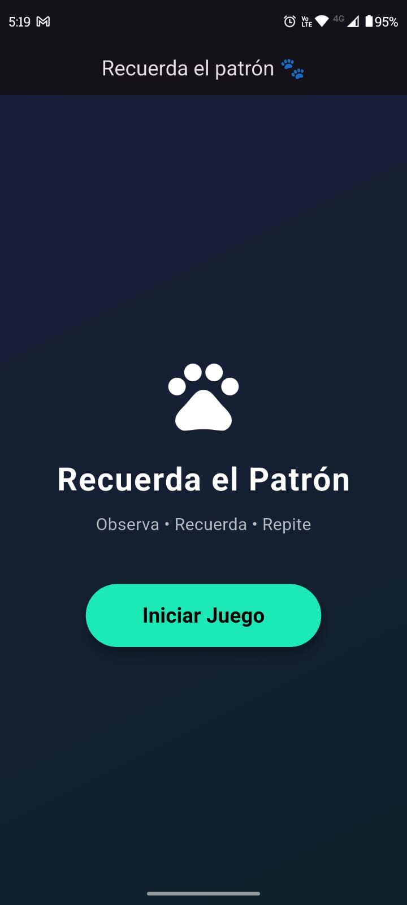
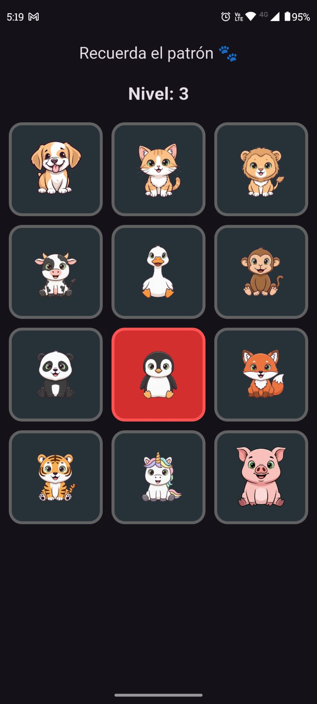
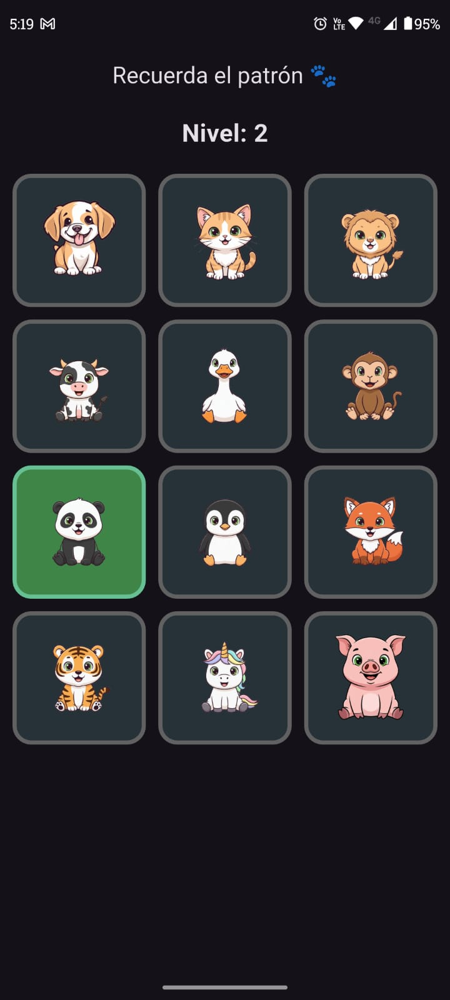
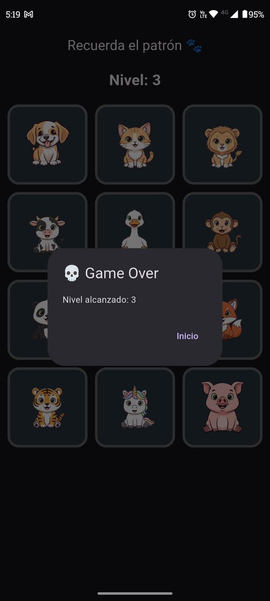

# Recuerda el Patrón

Un juego de memoria visual desarrollado en Flutter donde debes recordar y repetir secuencias de animales cada vez más largas.


## 📖 Descripción

**Recuerda el Patrón** El jugador debe observar una secuencia de animales iluminados y luego reproducir la secuencia en el mismo orden. Con cada nivel, la secuencia se vuelve más larga y desafiante.

### 🎮 Cómo Jugar

1. Presiona el botón **"Iniciar Juego"**
2. Observa la secuencia de animales que se iluminan en rojo
3. Repite la secuencia tocando los animales en el mismo orden
4. Si aciertas, avanzas al siguiente nivel con una secuencia más larga
5. Si fallas, el juego termina y muestra tu nivel alcanzado

## 📸 Capturas de la Aplicación

### 🟢 Pantalla de Inicio
Pantalla inicial donde el jugador puede comenzar la partida.



---

### 🔴 Visualización de la Secuencia
El juego ilumina los animales en rojo para que el jugador memorice el patrón.



---

### 🟢 Turno del Jugador
El jugador repite la secuencia tocando los animales en el orden correcto.



---

### ❌ Fin del Juego
Cuando el jugador falla, se muestra un mensaje con el nivel alcanzado.



## 🛠️ Tecnologías Utilizadas

- Flutter
- Dart
- Material Design


## 📁 Estructura del Proyecto

```
patron_game/
├── lib/
│   ├── main.dart                    # Punto de entrada de la aplicación
│   ├── models/
│   │   └── game_state.dart          # Modelo de estado del juego
│   ├── screens/
│   │   └── patron_game_screen.dart  # Pantalla principal del juego
│   ├── widgets/
│   │   ├── game_grid.dart           # Cuadrícula de animales
│   │   ├── start_screen.dart        # Pantalla de inicio
│   │   └── game_over_dialog.dart    # Diálogo de fin de juego
│   └── utils/
│       └── constants.dart           # Constantes de la aplicación

```

## 🏗️ Arquitectura del Código

### Models (`lib/models/`)

- **`game_state.dart`**: Define el modelo de datos que representa el estado completo del juego
  - Secuencia de animales a recordar
  - Input del usuario
  - Estado de los tiles (activo, presionado)
  - Nivel actual
  - Turnos (usuario/juego)

### Screens (`lib/screens/`)

- **`patron_game_screen.dart`**: Pantalla principal que gestiona toda la lógica del juego
  - Control de flujo del juego
  - Reproducción de secuencias
  - Validación de input del usuario
  - Gestión de niveles

### Widgets (`lib/widgets/`)

- **`start_screen.dart`**: Pantalla de bienvenida con gradiente y botón de inicio
- **`game_grid.dart`**: Cuadrícula de 3x4 con los 12 animales
- **`game_over_dialog.dart`**: Diálogo modal que muestra el nivel alcanzado

### Utils (`lib/utils/`)

- **`constants.dart`**: Centraliza todas las constantes de la aplicación
  - Colores y temas
  - Duraciones de animaciones
  - Textos de la interfaz
  - Rutas de assets

## 🎨 Personalización

### Cambiar Colores

Edita los colores en `lib/utils/constants.dart`:

```dart
static final Color activeColor = Colors.red.shade700;        // Color cuando el juego muestra
static final Color pressedColor = Colors.green.withAlpha(90); // Color cuando presionas
static final Color startButtonColor = Colors.tealAccent.shade400; // Color del botón
```

### Ajustar Velocidad del Juego

Modifica las duraciones en `lib/utils/constants.dart`:

```dart
static const Duration highlightDuration = Duration(milliseconds: 500);
static const Duration pauseBetweenHighlights = Duration(milliseconds: 300);
```

### Cambiar Tamaño de la Cuadrícula

Edita las constantes en `lib/utils/constants.dart`:

```dart
static const int gridColumns = 3;  // Número de columnas (actualmente 3x4)
```
## 🚀 Posibles Mejoras

- ➕ **Botón de reinicio**:  
  Permitir al jugador reiniciar la partida sin tener que perder aproposito para volver a la pantalla inicial.

- 📊 **Indicador de progreso de la secuencia**:  
  Mostrar en pantalla:
  - La longitud actual de la secuencia (por ejemplo: *Secuencia: 5 pasos*).
  - En qué paso de la secuencia va el jugador (por ejemplo: *Paso 3 de 5*).

Estas mejoras ayudarían a mejorar la experiencia del usuario y la claridad del juego durante partidas largas.
